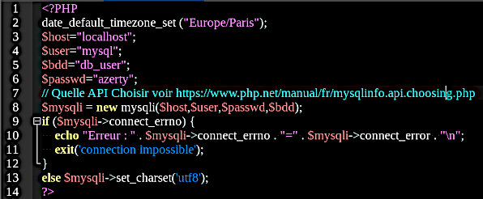

# connect_php
Connect_php est un exemple complet et opérationnel de gestion de la connexion des utilisateurs à une plateforme web. Toutefois, il s'agit d'une version simplifiée, destinée à illustrer l'utilisation des outils de cryptage et la génération d'un captcha par les langages de programmation utilisés (php et javascript). Pour être parfaitement sécurisé, certaines actions devront être réalisées sur le serveur (pas sur le client), des vérifications supplémentaires pourront être effectuées et un soin particulier sera porté afin de protéger l'accès à la base de donnée.

## Principe
L'utilisateur se connecte avec un nom et un mot de passe qui lui est propre. Les informations concernant l'utilisateur sont stockées dans une base de données, son mot de passe est crypté. 
Un captcha (image) propre à la session est généré puis une saisie est demandée afin de s'assurer que l'utilisateur est bien une personne.
Les mentions légales concernant les traceurs (cookies) et la gestion des données personnelles doivent être adaptés à l'utilisation qu'en fait le site. Un consentement plus formel peut être demandé par le biais d'une case à cocher.

### mot de passe
Un mot de passe sécurisé doit faire au moins 8 caractères (idéalement 12 caractères ou plus) et contenir des chiffres, de lettres en minuscules et majuscules ainsi que des caractères spéciaux. Selon les capacités de traitement du hacker, un mot de passe complexe de 8 caractères sera craqué (force brute) en une durée qui varie de quelques heures à deux mois alors qu'un mot de passe de 12 caractères necessitera plus de 10 000 années de traitement...

### Captcha
Renouvelé après plusieurs tentatives de connexion et crypté pour être traitable côté client, le CAPTCHA est une sécurité supplémentaire destiné à rendre inopérantes certaines tentatives d'intrusion. Sans surcharger le serveur, il renforce ainsi la fiabilité des mots de passe.

**CAPTCHA :** (« Completely Automated Public Turing Test To Tell Computers and Humans Apart ») inventé en 2000 par Luis von Ahn, Manuel Blum, Nicholas Hopper et John Langford de l'Université Carnegie Mellon. Les CAPTCHAs limitent l'action des robots susceptibles de tenter de s'introduire par la force brute ou de soumettre abusivement des formulaires.

## Installation
Télécharger le dépôt GitHub et l'installer à la racine du serveur web.

### Dépendences et extensions

**Php :** les extensions gd et mysqli devront être activées dans le php.ini.

**javascript :** La gestion du cryptage en javascript est réalisée grâce à une bibliothèque embarqué dans ./inc/bcrypt. Cet outil provient du dépôt suivant :
[Lien vers le dépot GitHub de **dcodeIO/bcrypt**](https://github.com/dcodeIO/bcrypt.js)

### La base de données
Une base de données **MySql** de test nommée **db_user** peut-être importée grace au script sql ./db/db_user.sql. Cette base de données contient une **table utilisateur**. 

**Initialisation :** il suffit d'éxécuter le script sql **db_user.sql** depuis un outil tel phpMyAdmin. La structure et le contenu de la table utilisateur sont les suivants :

 Le mot de passe en clair est conteu dans le champ **ut_mp** et ce même mot de passe est stocké au format crypté dans **ut_phrase**. Le mot de passe en clair est conteu dans le champ **ut_mp** et ce même mot de passe est stocké au format crypté dans **ut_phrase**. En production, la zone **ut_mp** devra être supprimée de la table.

**Connexion :** Pour se connecter à la base de données, le script php utilise le fichier **./parm/aa_param.php**. Ce fichier doit être protégé, sécurisé et adapté à votre environnement.

